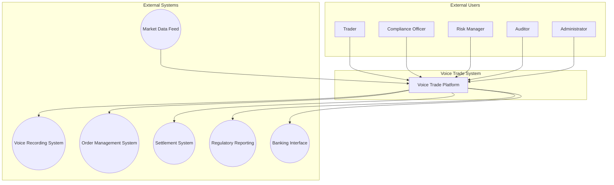
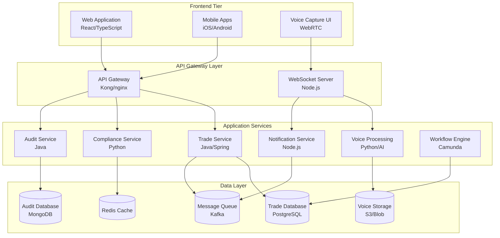
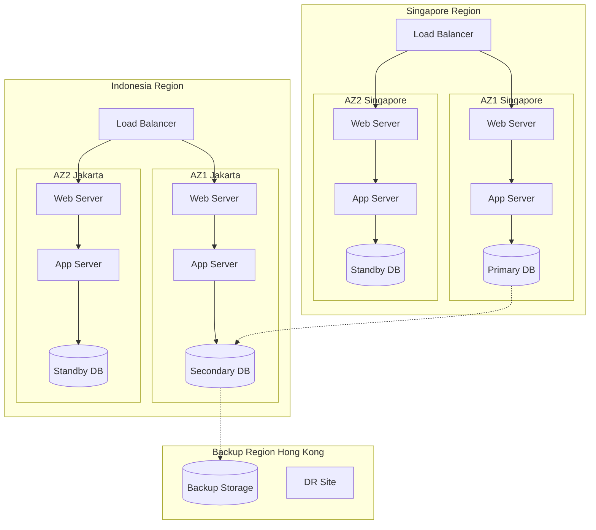
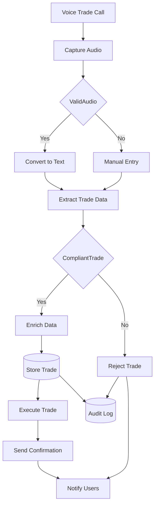
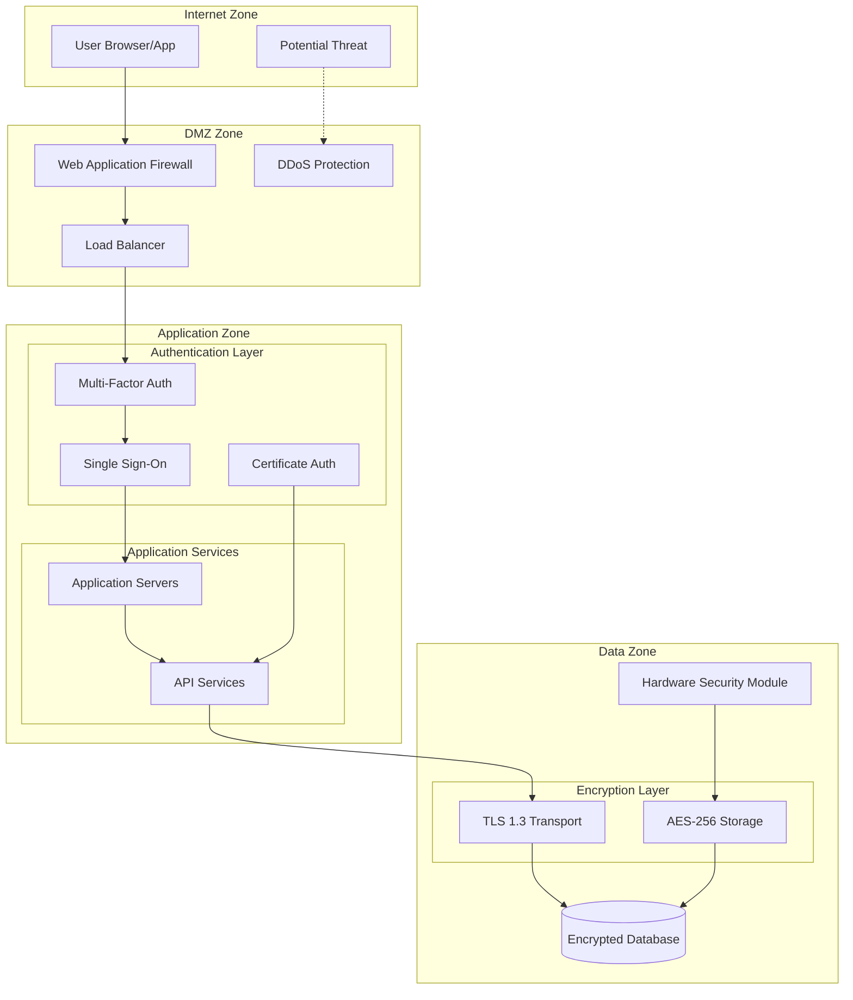
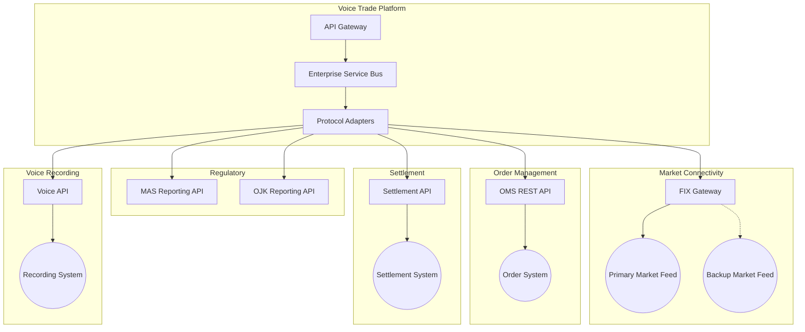
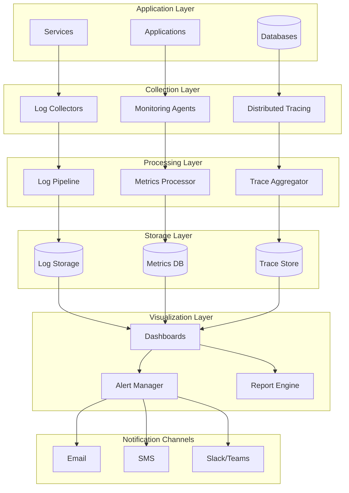

# Architecture Diagrams: Electronification of Voice Trades Under $1 Million

## Diagram Overview

This document presents a comprehensive visual architecture for the voice trade electronification system using C4 model principles. The diagrams illustrate a multi-tier, microservices-based architecture designed for high-criticality trading operations across Singapore and Indonesia markets. Key patterns include active-active deployment for zero downtime, event-driven communication for real-time processing, and comprehensive security layers ensuring regulatory compliance. Navigation starts with system context, drilling down through containers and components, then exploring deployment, data flow, security, integration, and observability aspects.

## 1. System Context Diagram (C4 Level 1)

The system context shows the Voice Trade Platform as the central system serving five user types (traders, compliance, risk, audit, admin) while integrating with six external systems for voice recording, order management, settlement, market data, regulatory reporting, and banking operations.

## 2. Container Diagram (C4 Level 2)

The container diagram reveals a microservices architecture with React/mobile frontends, API gateway, six specialized services (trade, compliance, voice, audit, notification, workflow), and a polyglot persistence layer using PostgreSQL, MongoDB, object storage, Redis, and Kafka.

## 3. Component Diagram (C4 Level 3)

```mermaid
flowchart TD
    subgraph "Trade Service Components"
        TC[Trade Controller]
        TV[Trade Validator]
        TE[Trade Engine]
        TR[Trade Repository]
        TM[Trade Mapper]
    end
    
    subgraph "Voice Service Components"  
        VC[Voice Controller]
        VR[Voice Recognition]
        VT[Voice Transcription]
        VS[Voice Storage]
        VA[Voice Analytics]
    end
    
    subgraph "Compliance Service Components"
        CC[Compliance Controller]
        RE[Rules Engine]
        RV[Regulation Validator]
        RL[Rule Library]
        CR[Compliance Reporter]
    end
    
    TC --> TV
    TV --> TE
    TE --> TR
    TE --> TM
    
    VC --> VR
    VR --> VT
    VT --> VA
    VR --> VS
    
    CC --> RE
    RE --> RV
    RV --> RL
    RE --> CR
```

Component breakdown shows internal structure of key services: Trade Service with validation/engine/repository pattern, Voice Service with recognition/transcription/analytics pipeline, and Compliance Service featuring rules engine with Singapore/Indonesia regulation validators.

## 4. Deployment Architecture

Multi-region deployment spans Singapore (primary), Jakarta (secondary), and Hong Kong (backup) with active-active configuration, multiple availability zones, load balancing, and synchronous replication between regions ensuring <15 minute RTO.

## 5. Data Flow Diagram

Data flow illustrates the journey from voice capture through recognition, validation, compliance checking, execution, and notification, with comprehensive audit logging at each decision point ensuring complete traceability.

## 6. Security Architecture

Security architecture implements defense-in-depth with WAF/DDoS protection at perimeter, multi-factor authentication, SSO integration, TLS 1.3 for transport, AES-256 encryption at rest, and HSM-based key management meeting regulatory requirements.

## 7. Integration Architecture

Integration architecture shows API Gateway fronting ESB with protocol adapters connecting to external systems via REST APIs, FIX protocol for markets, regulatory reporting interfaces for MAS/OJK, and voice recording integration.

## 8. Monitoring & Observability

Comprehensive observability stack captures logs, metrics, and traces from all layers, processes through dedicated pipelines, stores in specialized databases, visualizes via dashboards, and triggers multi-channel alerts ensuring <30 second incident detection.