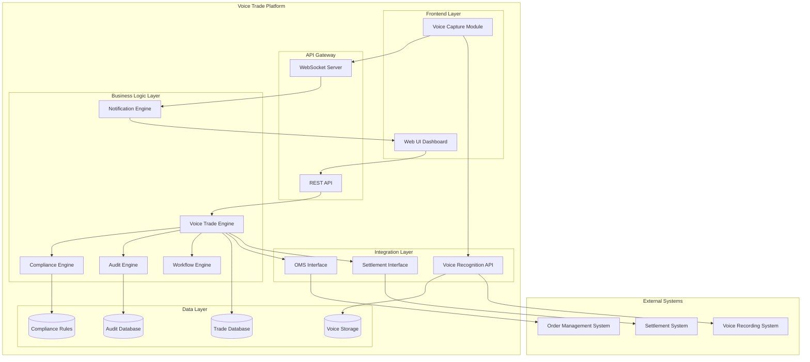
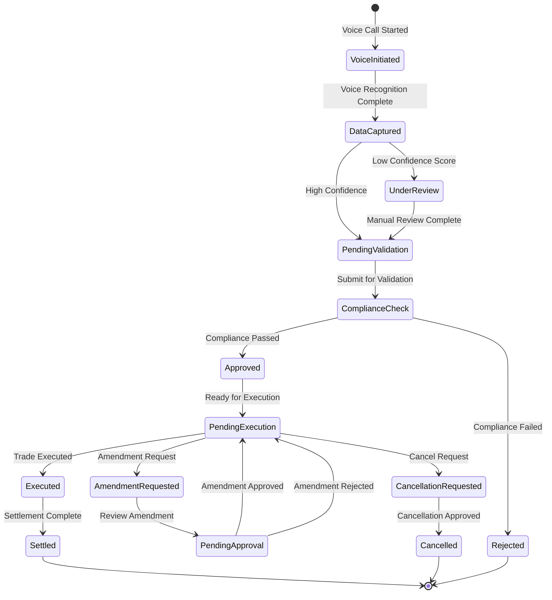

# Functional Requirements: Electronification of Voice Trades Under $1 Million

## 1. Context

The system will digitize voice-based trading processes for trades valued under $1 million, replacing manual phone-based workflows with an automated electronic platform. This addresses compliance requirements for Singapore and Indonesia markets while ensuring auditability, transparency, and reduced operational risk in low-value trade execution.

## 2. User Stories

**US-1:** Voice Trade Data Capture
- **As a** Trader
- **I want to** capture voice trade details electronically in real-time
- **So that** I can reduce manual errors and ensure all trade data is accurately recorded
- **Story Points:** 5
- **Priority:** Critical
- **Tags:** Backend, API, Data Entry, Voice Recognition
- **Epic:** Trade Capture and Processing

**US-2:** Trade Validation and Compliance
- **As a** Compliance Officer
- **I want to** automatically validate trades against Singapore and Indonesia regulations
- **So that** I ensure all trades comply with local laws before execution
- **Story Points:** 8
- **Priority:** Critical
- **Tags:** Compliance, Validation, Backend, Security
- **Epic:** Compliance and Risk Management
- **Related Stories:** US-1

**US-3:** Trade Confirmation and Notification
- **As a** Operations Manager
- **I want to** receive real-time notifications of trade confirmations
- **So that** I can monitor trade flow and respond to issues immediately
- **Story Points:** 3
- **Priority:** High
- **Tags:** Frontend, Notifications, Real-time, Dashboard
- **Epic:** Trade Capture and Processing
- **Related Stories:** US-1, US-2

**US-4:** Audit Trail Management
- **As a** Auditor
- **I want to** access complete audit trails for all voice trades
- **So that** I can review trade history and ensure regulatory compliance
- **Story Points:** 5
- **Priority:** High
- **Tags:** Audit, Logging, Database, Compliance
- **Epic:** Compliance and Risk Management
- **Related Stories:** US-1, US-2, US-3

**US-5:** Voice Recording Integration
- **As a** Risk Manager
- **I want to** link electronic trade records with original voice recordings
- **So that** I can verify trade details against source conversations when needed
- **Story Points:** 8
- **Priority:** High
- **Tags:** Integration, Voice Recording, Storage, Backend
- **Epic:** Trade Capture and Processing
- **Related Stories:** US-1, US-4

**US-6:** Trade Amendment and Cancellation
- **As a** Trader
- **I want to** amend or cancel voice trades before settlement
- **So that** I can correct errors or respond to client requests
- **Story Points:** 5
- **Priority:** Medium
- **Tags:** Trade Management, Backend, API, Workflow
- **Epic:** Trade Capture and Processing
- **Related Stories:** US-1, US-2, US-4

## 3. Functional Requirements

### FR-1: Voice Trade Data Capture
System shall capture and convert voice trade data to electronic format

**Inputs:**
- Voice audio stream
- Trader ID
- Trade context metadata

**Outputs:**
- Structured trade object
- Confidence score
- Fields requiring review

**Main Flow:**
1. Receive voice audio stream
2. Apply voice recognition with financial terminology
3. Extract trade parameters
4. Structure data into trade object
5. Calculate confidence score
6. Flag low-confidence fields

**Triggers:**
- Voice call initiation
- Manual trade entry request

**Related User Stories:** US-1

### FR-2: Trade Validation Against Regulations
System shall validate trades against jurisdiction-specific regulations

**Inputs:**
- Trade data
- Jurisdiction (SG/ID)
- Counterparty information

**Outputs:**
- Validation status
- Compliance report
- Rejection reasons if applicable

**Main Flow:**
1. Identify trade jurisdiction
2. Load applicable regulatory rules
3. Execute validation checks
4. Generate compliance report
5. Return validation result

**Triggers:**
- Trade submission
- Pre-execution validation request

**Related User Stories:** US-2

### FR-3: Audit Trail Maintenance
System shall maintain comprehensive audit trail for all trades

**Inputs:**
- Trade events
- User actions
- System decisions

**Outputs:**
- Audit log entries
- Audit reports
- Compliance certificates

**Main Flow:**
1. Capture triggering event
2. Record timestamp and user
3. Log event details
4. Store in immutable audit store
5. Index for search

**Triggers:**
- Any trade state change
- User action
- System decision

**Related User Stories:** US-4

### FR-4: Voice Recording Integration
System shall integrate voice recordings with trade records

**Inputs:**
- Voice recording file
- Trade ID
- Timestamp range

**Outputs:**
- Recording reference
- Playback capability
- Transcription

**Main Flow:**
1. Store voice recording
2. Create recording metadata
3. Link to trade record
4. Enable playback interface
5. Generate searchable transcription

**Triggers:**
- Trade capture completion
- Recording upload

**Related User Stories:** US-5

### FR-5: Real-time Notifications
System shall provide real-time notifications for trade events

**Inputs:**
- Trade events
- User preferences
- Notification rules

**Outputs:**
- Push notifications
- Email alerts
- Dashboard updates

**Main Flow:**
1. Detect trade event
2. Identify notification recipients
3. Apply notification rules
4. Send notifications via configured channels
5. Update dashboard

**Triggers:**
- Trade execution
- Validation failure
- Amendment request

**Related User Stories:** US-3

### FR-6: Trade Amendment and Cancellation
System shall support trade amendments and cancellations with approval workflow

**Inputs:**
- Original trade
- Amendment details
- Cancellation request
- Approver credentials

**Outputs:**
- Updated trade
- Approval status
- Audit trail
- Notifications

**Main Flow:**
1. Receive modification request
2. Validate requester permissions
3. Route to approver if required
4. Apply changes upon approval
5. Update all related systems
6. Generate notifications

**Triggers:**
- Amendment request
- Cancellation request

**Related User Stories:** US-6

## 4. Acceptance Criteria

### US-1: Voice Trade Data Capture
- **AC-1:** Given a voice trade call is initiated, When trade details are spoken by the trader, Then system captures and converts voice to structured trade data
- **AC-2:** Given trade data is captured from voice, When conversion is complete, Then data is displayed for verification within 2 seconds
- **AC-3:** Given voice trade data is captured, When data contains ambiguous or unclear information, Then system highlights fields requiring manual review

### US-2: Trade Validation and Compliance
- **AC-4:** Given a trade is submitted for validation, When trade origin is Singapore, Then system applies Singapore MAS regulations
- **AC-5:** Given a trade is submitted for validation, When trade origin is Indonesia, Then system applies OJK regulations
- **AC-6:** Given a trade fails compliance validation, When validation is complete, Then system blocks execution and provides detailed rejection reason

### US-3: Trade Confirmation and Notification
- **AC-7:** Given a trade is successfully executed, When confirmation is received, Then system sends notification within 1 second
- **AC-8:** Given multiple trades are executed, When user views dashboard, Then all trade confirmations are displayed in chronological order

### US-4: Audit Trail Management
- **AC-9:** Given a trade has been executed, When audit trail is requested, Then system provides complete trade lifecycle including voice recording reference
- **AC-10:** Given audit search is performed, When date range is specified, Then system returns all trades within range with full details
- **AC-11:** Given audit trail is accessed, When export is requested, Then system generates compliant audit report in PDF/Excel format

### US-5: Voice Recording Integration
- **AC-12:** Given a voice trade is captured, When trade is saved, Then system stores reference to voice recording with timestamp
- **AC-13:** Given trade record is accessed, When voice playback is requested, Then system retrieves and plays corresponding voice segment

### US-6: Trade Amendment and Cancellation
- **AC-14:** Given a trade is pending settlement, When amendment is requested, Then system allows modification with approval workflow
- **AC-15:** Given a trade amendment is made, When amendment is saved, Then system creates audit entry with reason and approver
- **AC-16:** Given a trade cancellation is requested, When cancellation is approved, Then system reverses trade and notifies all parties

## 5. Error & Edge Cases

1. Voice recognition failure due to poor audio quality or heavy accent
2. Network timeout during trade submission causing duplicate entries
3. Conflicting regulations between Singapore and Indonesia for cross-border trades
4. System unavailability during market hours requiring fallback procedures
5. Partial trade execution requiring special handling
6. Voice recording storage failure requiring alternative audit mechanism
7. Multiple simultaneous amendment requests for same trade
8. Regulatory rule changes requiring system update during trading hours
9. Authentication token expiration during long voice calls
10. Database connection pool exhaustion during high volume periods

## 6. Assumptions

1. Voice recognition technology can achieve 95%+ accuracy for financial terminology
2. All traders will have unique identifiers for authentication
3. Voice recordings can be stored for minimum regulatory retention period (7 years)
4. Network bandwidth sufficient for real-time voice streaming and processing
5. Existing trade settlement systems have APIs for integration
6. Compliance rules for SG and Indonesia are well-documented and stable
7. Users have modern browsers supporting WebRTC for voice capture
8. Trade volume will not exceed 10,000 transactions per day initially

## 7. Open Questions

1. What specific MAS regulations apply to voice trades under $1M in Singapore?
2. What are the exact OJK requirements for Indonesia voice trade electronification?
3. Should the system support other Southeast Asian jurisdictions in future?
4. What is the required voice recording retention period for each jurisdiction?
5. Are there preferred voice recognition providers or must it be built in-house?
6. What are the acceptable system response times for trade validation?
7. Should the system integrate with existing order management systems (OMS)?
8. What authentication methods are required (biometric, 2FA, etc.)?
9. Are there specific audit report formats required by regulators?
10. What is the disaster recovery and business continuity requirement?

## 8. Traceability Matrix

| Requirement ID | User Story | Acceptance Criteria IDs | Notes |
|----------------|------------|------------------------|-------|
| FR-1 | US-1 | AC-1, AC-2, AC-3 | Core voice capture functionality |
| FR-2 | US-2 | AC-4, AC-5, AC-6 | Compliance validation engine |
| FR-3 | US-4 | AC-9, AC-10, AC-11 | Audit trail implementation |
| FR-4 | US-5 | AC-12, AC-13 | Voice recording integration |
| FR-5 | US-3 | AC-7, AC-8 | Notification system |
| FR-6 | US-6 | AC-14, AC-15, AC-16 | Trade lifecycle management |

## 9. ADO Work Item Details

### Epics
1. Trade Capture and Processing
2. Compliance and Risk Management
3. System Integration and Infrastructure

### Features
1. Voice Recognition and Transcription Service
2. Trade Validation Engine
3. Audit Trail Management System
4. Real-time Notification Framework
5. Trade Amendment Workflow
6. Compliance Rules Engine
7. Voice Recording Storage and Retrieval

### Task Breakdown by User Story

#### US-1: Voice Trade Data Capture
- Design voice capture API schema
- Implement voice recognition service integration
- Create trade data model and database schema
- Build trade entry validation logic
- Develop confidence scoring algorithm
- Create manual review interface
- Write unit tests for voice capture
- Perform integration testing with voice provider

#### US-2: Trade Validation and Compliance
- Document SG MAS compliance rules
- Document Indonesia OJK compliance rules
- Design rules engine architecture
- Implement Singapore validation rules
- Implement Indonesia validation rules
- Create compliance reporting module
- Build rejection handling workflow
- Test compliance scenarios

#### US-3: Trade Confirmation and Notification
- Design notification service architecture
- Implement WebSocket for real-time updates
- Create notification preferences management
- Build dashboard UI components
- Implement email notification service
- Create push notification integration
- Test notification delivery
- Optimize notification performance

#### US-4: Audit Trail Management
- Design audit database schema
- Implement audit logging service
- Create audit search API
- Build audit report generator
- Implement data retention policies
- Create audit UI dashboard
- Test audit trail completeness
- Validate regulatory compliance

#### US-5: Voice Recording Integration
- Design recording storage architecture
- Implement recording upload service
- Create recording metadata model
- Build playback API
- Implement recording search
- Create playback UI component
- Test recording retrieval performance
- Implement recording retention policy

#### US-6: Trade Amendment and Cancellation
- Design amendment workflow
- Implement amendment API
- Create cancellation logic
- Build approval workflow engine
- Implement notification for amendments
- Create amendment UI forms
- Test amendment scenarios
- Validate audit trail for amendments

### Definition of Done
1. Code reviewed and approved by senior developer
2. Unit test coverage > 80%
3. Integration tests passing
4. Security scan completed with no critical issues
5. Performance tests meet SLA requirements
6. Documentation updated (API, user guide)
7. Compliance validation completed for SG and Indonesia
8. Accessibility standards met (WCAG 2.1 AA)
9. Deployed to staging environment
10. UAT sign-off received from business stakeholders

### Sprint Planning
- **Sprint 1-2:** Core voice capture and trade data model (US-1)
- **Sprint 3-4:** Compliance validation engine (US-2)
- **Sprint 5:** Notification system and dashboard (US-3)
- **Sprint 6-7:** Audit trail implementation (US-4)
- **Sprint 8-9:** Voice recording integration (US-5)
- **Sprint 10:** Trade amendments and cancellations (US-6)
- **Sprint 11:** End-to-end integration testing
- **Sprint 12:** Performance optimization and hardening
- **Sprint 13:** UAT and production deployment preparation

## Appendix: System Architecture Diagram

## Appendix: Trade State Flow Diagram

