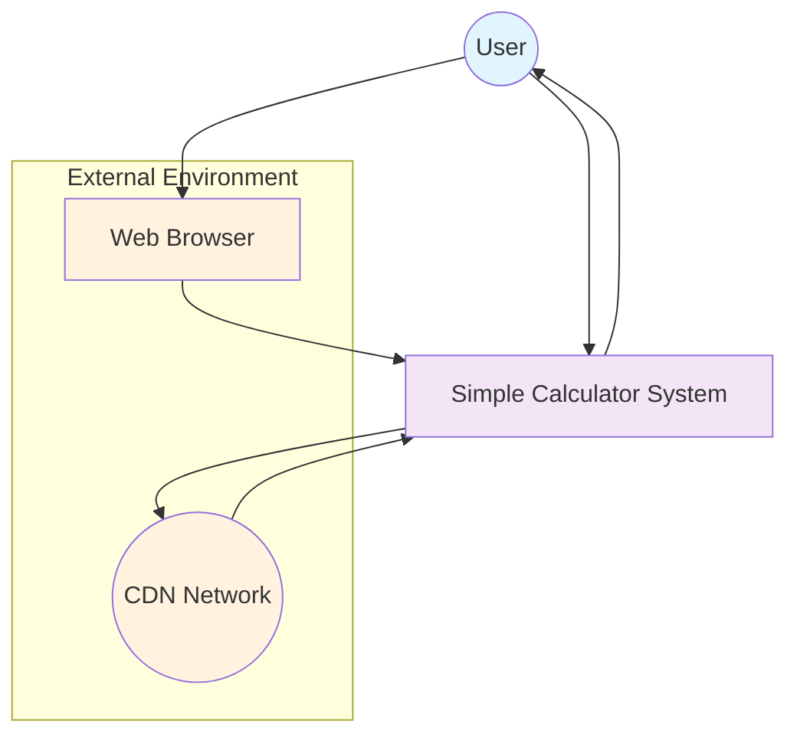
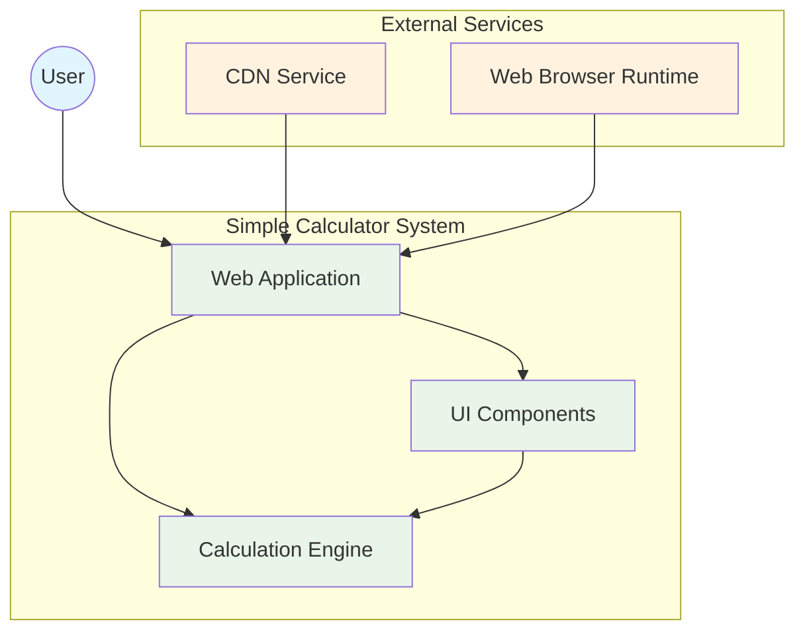
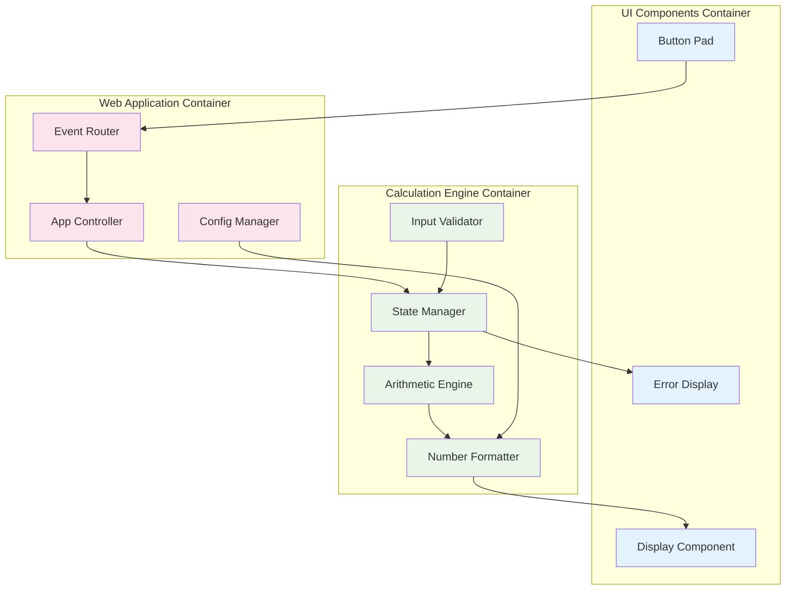
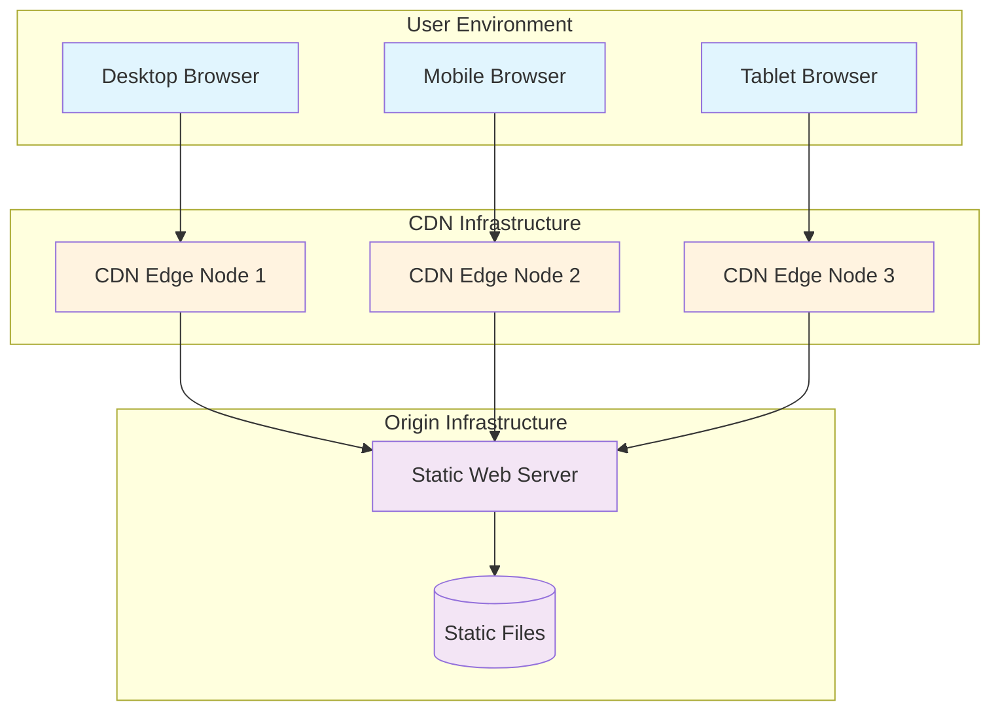
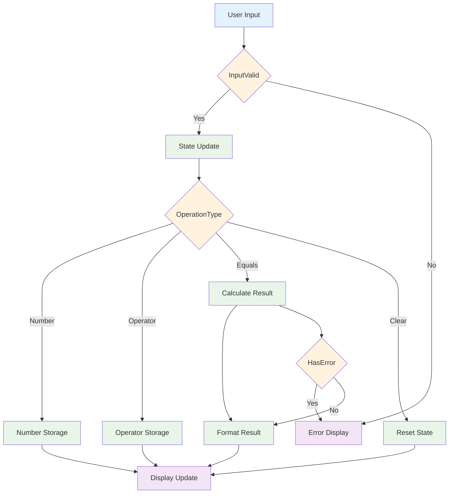
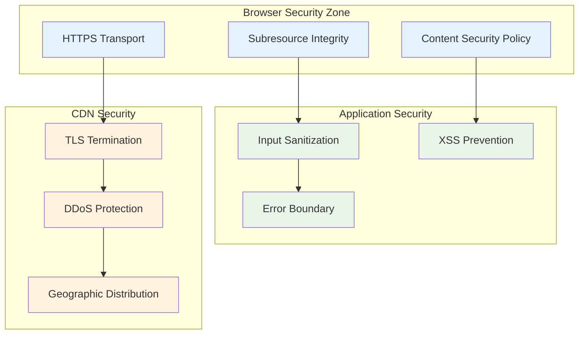
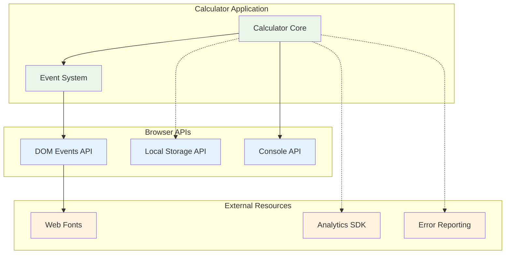
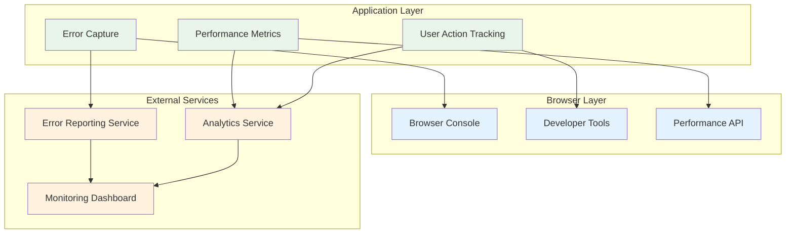

# Simple Calculator - Architecture Diagrams

## Diagram Overview

This document presents a comprehensive architectural view of the Simple Calculator application through multiple diagram perspectives. The visual representation follows the C4 model approach, starting from high-level system context and drilling down to detailed component interactions. Key architectural patterns illustrated include client-side single-page application architecture, event-driven UI interactions, and stateless computation patterns. The diagrams progress from external system boundaries through internal component structure, deployment topology, data flows, security boundaries, and observability mechanisms.

## System Context Diagram (C4 Level 1)

The system context shows the Simple Calculator as a standalone client-side application accessed through web browsers. Users interact directly with the calculator interface, with no backend services required. The CDN provides static asset delivery for initial application loading.

## Container Diagram (C4 Level 2)

The container diagram reveals three main containers within the calculator system: the Web Application container handling overall coordination, UI Components managing user interface elements, and the Calculation Engine processing mathematical operations. All containers run within the browser environment.

## Component Diagram (C4 Level 3)

The component diagram details internal structure with clear separation of concerns. UI components handle user interactions, the calculation engine manages mathematical operations and state, while the web application layer coordinates between UI and engine components.

## Deployment Architecture

The deployment architecture shows a simple static content delivery model. Client devices access the calculator through geographically distributed CDN edge nodes, which cache static assets from the origin web server for optimal performance.

## Data Flow Diagram

The data flow diagram illustrates how user inputs flow through validation, state management, calculation processing, and display updates. Error conditions are handled at multiple points with graceful degradation to error display states.

## Security Architecture

The security architecture implements defense-in-depth with browser-level security policies, application-level input validation and XSS prevention, and CDN-level DDoS protection and secure transport.

## Integration Architecture

The integration architecture shows minimal external dependencies with primary integration through browser APIs. Optional integrations include analytics and error reporting services, maintaining the application's standalone nature.

## Monitoring & Observability

The monitoring architecture provides comprehensive observability through error tracking, performance monitoring, and user behavior analytics. Browser-native tools supplement external monitoring services for complete visibility into application health and usage patterns.

---

*Generated with systematic architectural analysis covering all quality attributes and functional requirements specified in the product requirements documentation.*